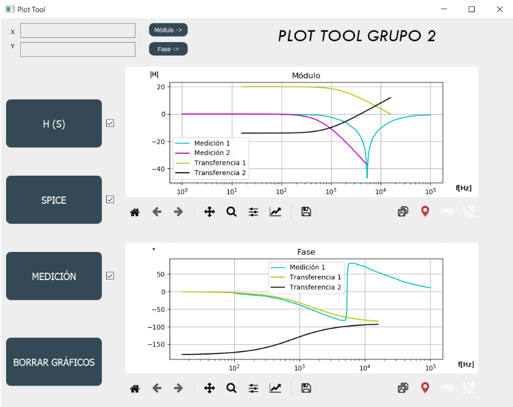

# TP1

This is the first lab exercise guide of Circuit Theory.

Here you can find two different parts:
1) Two easy experiences related to electric passive filters. 
2) The development of a GUI made with Python allowing the user to overlay frequency response graphs. 

On this app the Filter data can be entered in the following 3 ways:

- Transfer function.
- LTspice file.
- Excel or csv template with measurements.

To download the source code of the program follow the instructions inside the "Plot-Tool" folder.

## Image of the program running.

