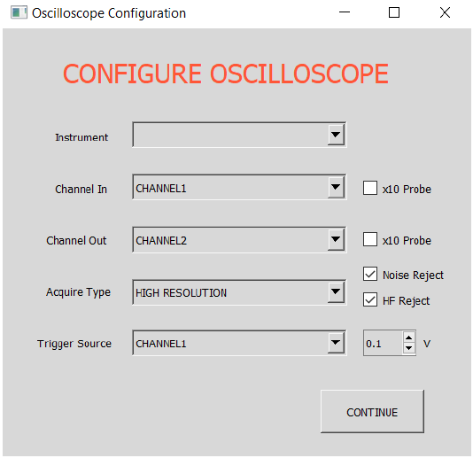
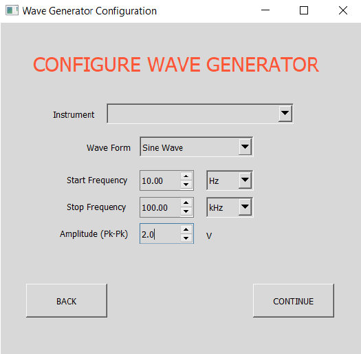
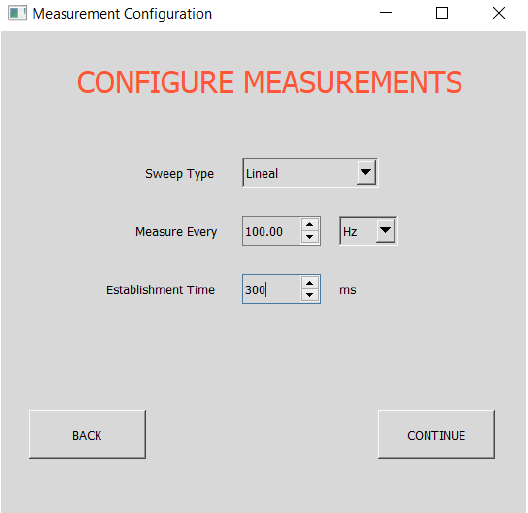

# What it is

This folder contains a program that can make automatic measurements of the frecuency response of a circuit.

For this, the program has control of the function generator and the oscilloscope connected to the computer to perform the measurements and store the results.

# Requirements

It is necessary to have certain requirements listed below to use the program.

- Python shell or interpreter. ([Download Site](https://www.python.org/downloads/)).
- Library pyvisa. ([Instalation](https://pyvisa.readthedocs.io/en/latest/introduction/getting.html)).
- NI-VISA. ([Download Site](https://www.ni.com/es-cr/support/downloads/drivers/download.ni-visa.html#305862)).

## Running the program

To run the program write on your cmd (with your perisferics connected):

```sh
$ python main.py
```

After running the program, different windows will open. In each of them you must configure
the parameters mentioned.

There is a window for oscilloscope configuration
(figure 1), one for the function generator (figure 2) and one for measurements (figure3).

<br>

<div align="center">

<p>Oscilloscope configuration</p>
</div>

<br>


<div align="center">

<p>Function generator configuration</p>
</div>

<br>

<div align="center">

<p>Measurements configuration</p>
</div>
<br>

After the measurements have been made, the program displays the results in the form of graphs with
logarithmic horizontal scale. A graph is made for the module and one for the phase. 

The user can decide whether to save the results or perform again the measures. If he decides to save the results, those are saved in a csv format in a directory to be selected by the user in a pop-up window.