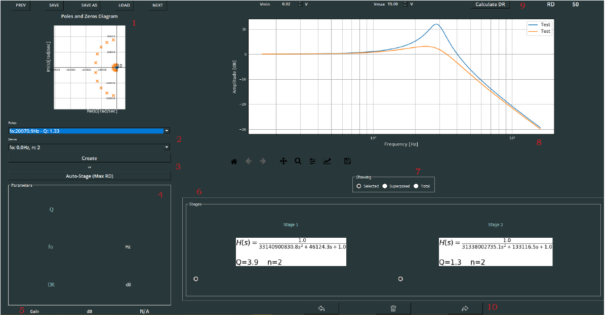

# Analog Filter Maker

<h2>
  Instructions for running the program
</h2>

To run the program, install all the dependencies that are listed in the file called "requirements". To do that you can install it with your prefered IDE (for example PyCharm) or run the next command on your cmd, to do that you have to have installed python on your machine.

## What it is

This is a program to design diferent types of analog filters such as low-pass filters, high-pass filters, band-pass filters, etc. For this the program uses the diferent aproximations selected by the user such as Chebyshev, Bessel, Legendre etc.

## Getting Started with cmd

to run the program with cmd you need to have installed [python](https://www.python.org/downloads/) on your machine.

#### 0. Install pip

In the Command Prompt (CMD):

```sh
$ python get-pip.py
```

#### 1. Clone the repo

```sh
$ git clone https://github.com/matifrancois/ITBA-Circuit_Theory
$ cd ITBA-Circuit_Theory/TP4_TC/AnalogFilterMaker/
```

#### 2. Install dependencies:

```sh
$ pip install matplotlib
```

```sh
$ pip install numpy
```

```sh
$ pip install scipy
```

```sh
$ pip install PyQt5
```

#### 3. Run the app

```sh
$ python main.py
```


## Preview

<br>
<br>

<div align="center">



</div>

<br>

## More information

To get more information about how to use the app see the file TP4_TC or the file "instructivo de uso.pdf"
